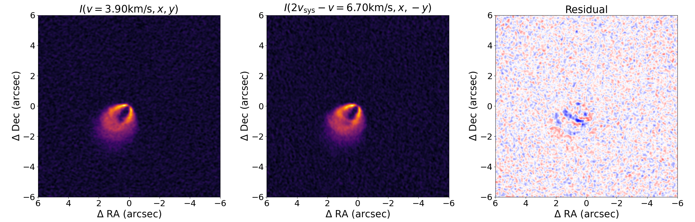
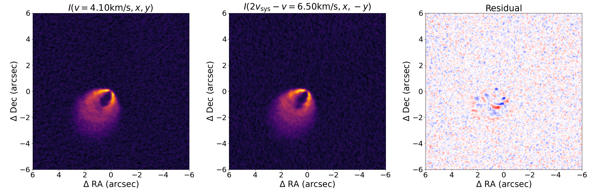
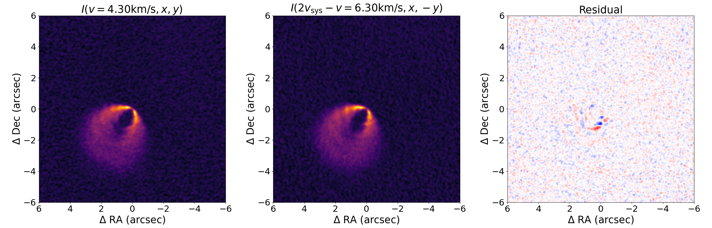
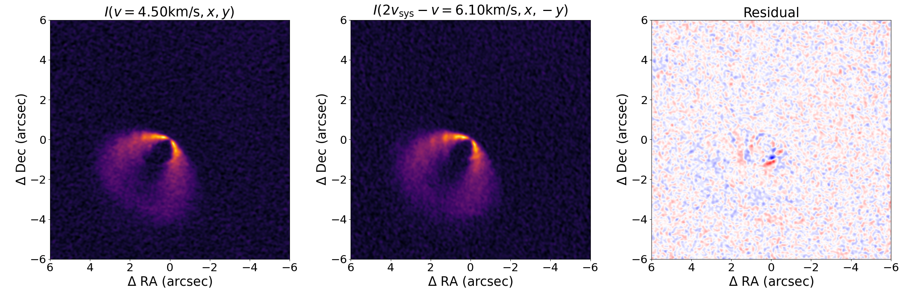
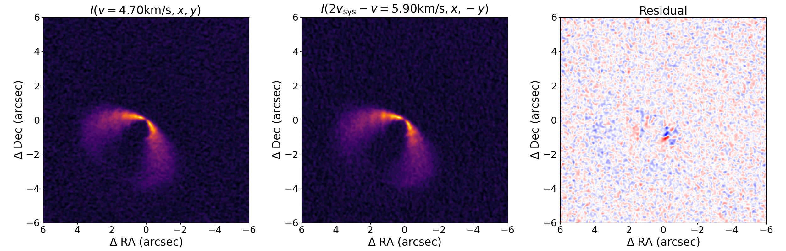
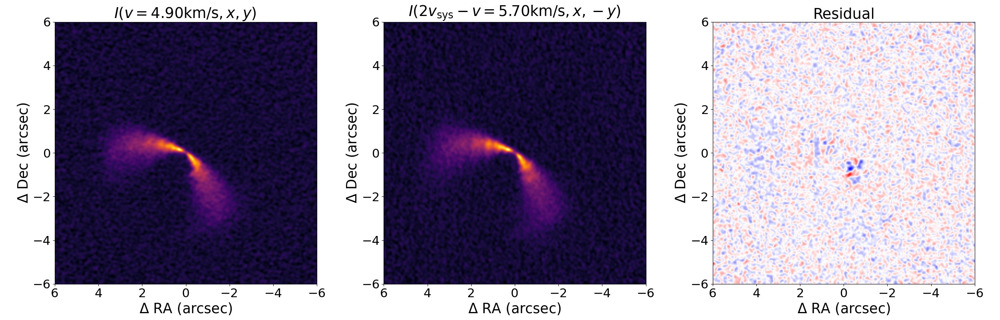
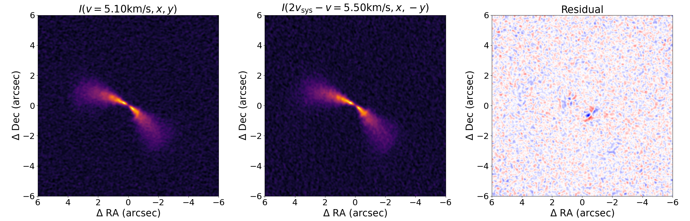

MWC480 Tutorial
=================
We used MAPS CO data for MWC480, "MWC_480_CO_220GHz.0.15arcsec.image.pbcor.fits". 

You can get the data through the following link of the project: https://alma-maps.info/data.html
 

.. code:: python

    import numpy as np
    from asymmvelo import asymm_make, asymm_optimize

Cube data that you want to analyze

.. code:: python

   input_fits = "/path/to/cube"

.. code:: python

   # Initial parameters
   pa_rad_initial = 148 * np.pi/180.0 ## radian
   x_cen_initial = 0 ## arcsec
   vsys_initial = 5.1 ## km/s
   initial_guess = [vsys_initial, x_cen_initial,  pa_rad_initial]

   # Interpolation settings for xy grid in comaring orignal/symmetric images in optimization
   # Downgrading images to make computation faster
   inp_max = 6  ##arcsec
   n_points = 120

   vsys_obs = 5.3

   # Velocity array for fitting, adjusted by the systemic velocity in optimzation
   vec_val_arr = np.array([-1.4, -0.8, -0.2, 0.2, 0.8, 1.4]) + vsys_obs  ## km/s

Load image data and coordinates from the FITS file

.. code:: python

   data, x_coord_arcsec, y_coord_arcsec, velocity_axis = asymm_make.load_image_coordinate_velocity_from_fits(input_fits)

Setting grids for observation and inpoterlation

.. code:: python

   xx, yy = np.meshgrid(x_coord_arcsec, x_coord_arcsec)
   xx_inp, yy_inp = asymm_make.make_coordinate_for_interpolation(inp_max, n_points)

Interpolation of data

.. code:: python

    cube_data_interpolator = asymm_make.make_interpolator_for_v_x_y_channel(velocity_axis, x_coord_arcsec,  data)

Optimzation for three parameters

.. code:: python

   result_all_fit = asymm_optimize.optimize_each_and_all(initial_guess, xx_inp, yy_inp, cube_data_interpolator, vec_val_arr)

The derived parameters are follows: 

.. code:: text

    vsys, x_cen, pa = 5.29810649 0.01703167 2.57963772

Plotting residual channel maps

.. code:: python

   import matplotlib.pyplot as plt
   import matplotlib as mpl
   mpl.rcParams['font.size'] = 22
   mpl.rcParams['axes.labelsize'] = 22

   # Extract optimized parameters
   vsys = result_all_fit.x[0]
   x_cen = result_all_fit.x[1]
   pa_rad= result_all_fit.x[2]

   xx_inp_show, yy_inp_show = asymm_make.make_coordinate_for_interpolation(inp_max , 240)

   # Loop over each velocity value in vec_val_arr
   for vec_val in vec_val_arr: 

      # Generate the line symmetry images from interpolation
      image_vec_val, image_vec_sym = asymm_make.make_line_sym_image(cube_data_interpolator, xx_inp_show, yy_inp_show,vec_val, vsys , x_cen,  pa_rad )
      fig, axs = plt.subplots(1, 3, figsize=(25, 8))
      plots = [image_vec_val, image_vec_sym, image_vec_val- image_vec_sym]  # プロットするデータ
      titles = [ r'$I(v=%.2f {\rm km/s}, x, y)$ ' % vec_val, r'$I(2v_{\rm sys} - v = %.2f {\rm km/s}, x,-y)$' % (2 * vsys - vec_val), r'Residual']  # 各プロットのタイトル
      for i in range(3):
         if i<2:
               lim = np.max(plots[0])#(np.percentile(plots[i], q = [0.01,99.9])
               lim2 = np.min(plots[0])#(np.percentile(plots[i], q = [0.01,99.9])
               axs[i].imshow(plots[i], origin='lower', cmap='inferno',
                           extent=(xx_inp.max(), xx_inp.min(), xx_inp.min(), xx_inp.max()), vmin = lim2, vmax = lim)#, vmin = -lims[1], vmax = lims[1])
         else:
               lim = np.max(np.abs(plots[2]))#(np.percentile(plots[i], q = [0.01,99.9])
               axs[i].imshow(plots[i], origin='lower', cmap='bwr',
                        extent=(xx_inp.max(), xx_inp.min(), xx_inp.min(), xx_inp.max()), vmin = -lim, vmax = lim)
         axs[i].set_xlabel('$\\Delta$ RA (arcsec)', fontsize=25)
         axs[i].set_ylabel('$\\Delta$ Dec (arcsec)', fontsize=25)
         axs[i].set_title(titles[i])
         axs[i].set_aspect('equal')
      plt.tight_layout()  
      fig.savefig(f'./fig/tutorial_MWC480_tutorial_{vec_val_arr.tolist().index(vec_val)}.png')    
      plt.show()

Output:

Making residual cube with the same size as input cube data

.. code:: python

    import os

    # Path to the output FITS file for residuals
    out_fits = "/path/to/output_/cube/"

    # Generate the residual FITS file using the optimized parameters
    if not os.path.exists(out_fits):
        data = asymm_make.make_residual_fits(original_fits, out_fits, result_all_fit.x, xx_inp, yy_inp, cube_data_interpolator)
    else:
        data, x_coord_arcsec, y_coord_arcsec, velocity_axis = asymm_make.load_image_coordinate_velocity_from_fits(out_fits)
